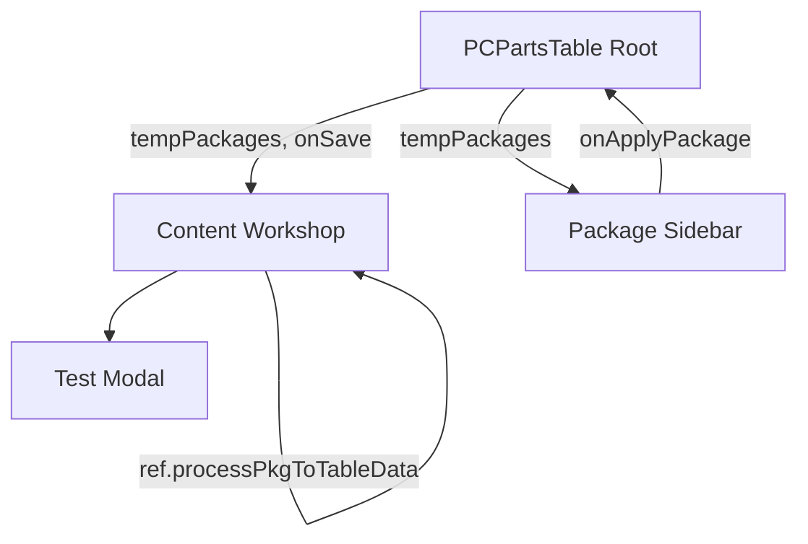

# 临时方案与多方案对比功能设计方案

## 1. 需求背景

用户希望在配置工坊中能够临时保存当前的配置方案（最多3个，仅内存存储），并能方便地在侧边栏查看和切换。同时，在测试配置模块中，需要支持多个方案之间的性能和硬件配置对比。

## 2. 架构调整

### 2.1 状态管理

- **临时方案列表**：维护在 `PCPartsTable` (根组件) 中。
- **当前配置状态**：保持在 `Content` 组件内部，不进行状态提升。
- **数据注入**：侧边栏应用方案时，继续使用现有的 `ref` 机制将数据注入 `Content`。

### 2.2 数据结构变更

- **Package**: `id` 支持 `number | string`。临时方案使用随机字符串 ID。

## 3. 详细实现步骤

### 3.1 根组件 `PCPartsTable` (`app/_components/PCPartsTable/index.tsx`)

- 添加 `tempPackages` 状态数组。
- 实现 `handleSaveTempPackage`：
    - 检查上限（3个）。
    - 如果超过，可以提示用户或替换最早的一个（根据需求，建议提示或自动覆盖）。
- 实现 `handleDeleteTempPackage`。

### 3.2 配置工坊 `Content` (`app/_components/PCPartsTable/Content/index.tsx`)

- 增加“临时保存”按钮。
- 实现转换逻辑：将当前的 `tableData` (只有 ID 和数量) 结合 `products` 数据转换为完整的 `Package` 对象。
- 将 `tempPackages` 传递给 `TestConfigModal`。

### 3.3 侧边栏 `PackageRecomment` (`app/_components/PCPartsTable/PackageRecomment/index.tsx`)

- 引入 `antd` 的 `Segmented` 组件。
- 增加 `mode` 状态：`popular` | `temporary`。
- 当 `mode === 'temporary'` 时，渲染 `tempPackages` 列表。
- 复用 `PackageList` 组件，但传入不同的数据源。

### 3.4 测试配置 `TestConfigModal` (`app/_components/PCPartsTable/Content/components/TestConfigModal.tsx`)

- **多选支持**：允许用户从当前配置和已保存的临时方案中选择多个进行对比。
- **性能对比视图**：
    - 使用表格展示不同方案在 1080p/2K/4K 下的 FPS 范围。
    - 增加可视化对比（如简单的进度条或颜色深浅）。
- **硬件对比视图**：
    - 纵向列出 CPU、显卡、内存等核心配件，横向展示不同方案的选型。
    - 高亮显示差异项。

## 4. 交互流程

1. 用户在配置工坊选好配件。
2. 点击“临时保存”，侧边栏自动切换到“临时方案”页签并显示新保存的方案。
3. 用户修改配置，再次保存。
4. 点击“测试配置”，在弹窗中勾选刚才保存的两个方案。
5. 弹窗展示两个方案的 FPS 对比和硬件参数对比。
